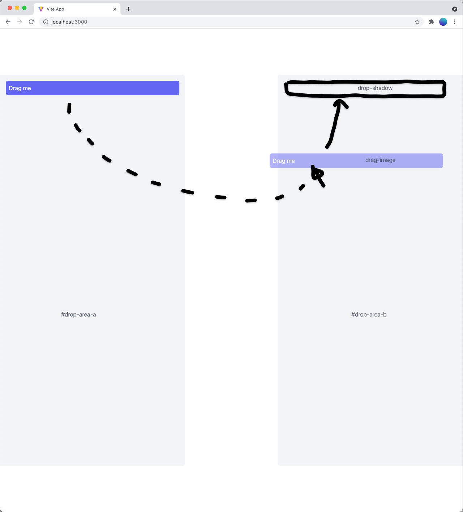

# Toggl Plan Take Home Project

## The Mission

Hello there future Toggl Plan Frontend Developer 👋 Your mission, should you choose to accept it, is to add drop functionality to this template:

-   "drag me" element should be draggable between `#drop-area-a` and `#drop-area-b`
-   please add drop shadow to indicate potential new position for the element. Note: drop shadow is an element (not the css property), similar to a drag image. Might be a clone of original dragged element or repositioned original element itself.
-   if dropped outside drop area, drag image should transition back to initial position
-   if dropped onto drop area, drag image should transition to the new position




Note: this template has basic layout and some parts of the interaction figured out for you.

## Getting started on your machine

The first step is to fork this repo so that a fork exists on your own GitHub account. After you have forked the repo, clone your forked version down onto your machine.

Install the repo's dependencies:

```
$ npm install
```

Then start the local server:

```
$ npm run dev
```

Please remember to commit often so we can see how you're doing 🙌

## Deploy

Once done, publish a minified build of the project to [Surge](http://surge.sh) or [Now](https://zeit.co), and share public URL.

To generate the build:

```
$ npm run build
```

And then upload the generated `dist` folder. For example

```
$ cd dist && surge
```

## Help

You can reach me at `vadim@toggl.com` to seek any clarifications.

Have fun!
